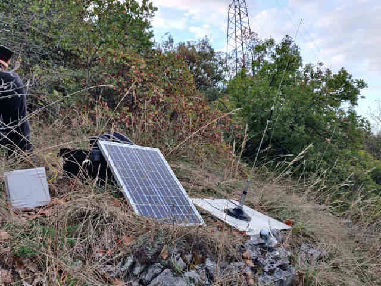

# Hamradio-pi-autonom

## Station's components
*   [an Orange Pi Zero LTS](http://www.orangepi.org/orangepizerolts/)
*   [a battery AGM/Cold 10Ah](https://www.all-batteries.fr/batterie-plomb/sonnenschein/a512-10s.html)
*   [A 25W solar panel](https://www.amazon.fr/gp/product/B07KG2TB6V)
*   [a MPPT charger](http://www.danjuliodesigns.com/products/makerpower.html)
*   [an ICOM H16T](http://www.rigpix.com/protrx/icom_ich16t.htm) (no more, Baofeng UV-3R on hold)
*   [An Ubiquiti Bullet 2](https://www.wifi-france.com/ubiquiti/bullet-2)
*   [An antenna 2.4Ghz 14dBi](https://www.amazon.fr/gp/product/B00N2NEUKS/ref=ppx_yo_dt_b_asin_image_o01_s00)
*   [A NPR 70](https://hackaday.io/project/164092-npr-new-packet-radio)
*   [A mobile antenna V/UHF Sirio HP 7000C](https://www.passion-radio.fr/mobile/hp7000c-540.html)

## Installation
You have to install a few software :
* Packet radio + APRS : [Direwolf](https://github.com/wb2osz/direwolf)
* Webcam : fswebcam `apt install fswebcam`
* DTMF + TONE 1750 Hz : [multimon-ng](https://github.com/valentintintin/multimon-ng)
* Voice pico2wave : libttspico-utils `apt install libttspico-utils`
* WiringPi + I2C
* Audio IN & OUT

## Configuration
 * You can find a sample config file in `assets` folders.
 * GPIO pins are in `src/services/gpio.service.ts`

## Build
Run `npm run build`

## Run
*I assume you add a `assets/config.ts` properly edited.*

`npm run start` (after build) or `npm run start-ts`.

## Use
Go to http://IP:PORT
